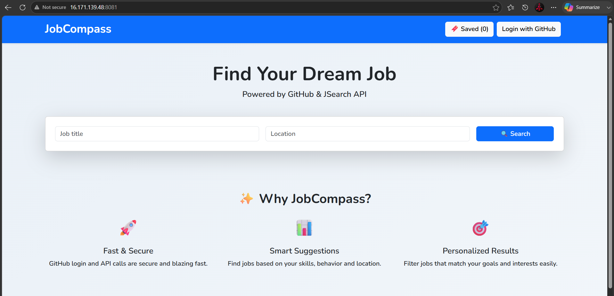

# CI/CD Pipeline Automation Using Jenkins and Docker

## Overview

This project demonstrates an end-to-end CI/CD pipeline using Jenkins and Docker to automate the deployment of a containerized web application. Jenkins clones the application source code from GitHub, builds a Docker image using NGINX, and deploys the application as a Docker container on a Linux server.

## Architecture

- GitHub Repository
- Jenkins Controller
- Jenkins Agent (Deployment Server)
- Docker
- NGINX
- AWS EC2

## Features

- Automated source code retrieval from GitHub
- Docker image creation using Jenkins Pipeline
- Automated NGINX container deployment
- Jenkins Controller and Agent integration
- End-to-end CI/CD workflow

## Technologies Used

- Jenkins
- Docker
- NGINX
- Git & GitHub
- AWS EC2
- Linux
- Groovy

## Project Structure

```text
.
├── Dockerfile
├── Jenkinsfile
├── index.html
├── styles.css
├── script.js
├── server.js
├── authMiddleware.js
├── rateLimiter.js
├── testApi.js
├── deployment.png
├── Pipeline Stage view.png
└── README.md
```

## Workflow

1. Push the application source code to GitHub.
2. Jenkins clones the repository.
3. Jenkins builds a Docker image using the Dockerfile.
4. Jenkins removes the existing container.
5. Jenkins deploys a new NGINX container.
6. Access the application using the server's public IP and mapped port.

## Jenkins Pipeline Stages

- Clone Repository
- Build Docker Image
- Deploy NGINX Container

## Output

### Application Deployment



### Jenkins Pipeline Stage View


## Learning Outcomes

- Jenkins Pipeline Automation
- Docker Container Deployment
- NGINX Web Server Deployment
- Jenkins Controller and Agent Configuration
- Continuous Integration and Continuous Deployment (CI/CD)

## Author

M. Boobeshwaran

Aspiring DevOps Engineer
